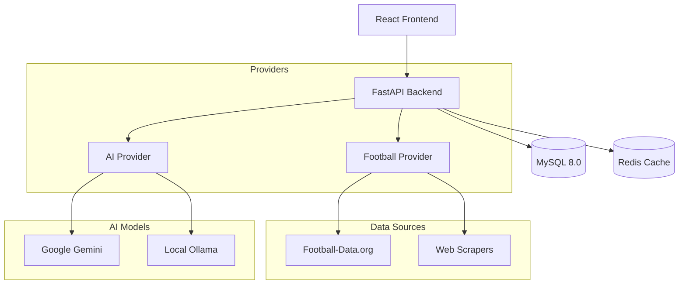

# ⚽ CouponFoot (FootGenius)


**CouponFoot** is an advanced, open-source football match analysis and prediction platform powered by Artificial Intelligence. It combines real-time data from multiple sources with LLMs (Google Gemini, Ollama) to provide deep insights, betting coupon evaluations, and interactive chat capabilities.

---

## 🚀 Features

- **🤖 AI-Powered Analysis**: Uses Google Gemini or local Ollama models to analyze matches and predict outcomes.
- **📊 Hybrid Data Architecture**: 
  - **Football-Data.org** (Primary, Free Tier friendly)
  - **Web Scrapers** (SofaScore, OddsChecker, FBref) for live scores and odds.
  - **Fallback System**: Robust error handling and data redundancy.
- **🎫 Coupon Evaluation**: Upload or input betting coupons for AI-driven risk assessment and optimization suggestions.
- **💬 AI Assistant**: Interactive chat to ask questions about teams, players, and historical stats.
- **💰 Subscription System**: Integrated with Stripe (International) and Moneroo (Mobile Money Africa).
- **📱 Modern Frontend**: Built with React, TypeScript, Tailwind CSS, and Zustand.

## 🏗️ Architecture

The project follows a modular **Provider Pattern** to allow easy swapping of data sources and AI models.



## 🛠️ Tech Stack

- **Backend**: FastAPI, SQLAlchemy 2.0 (Async), Alembic, Celery
- **Database**: MySQL 8.0, Redis
- **Frontend**: React, Vite, TypeScript, Tailwind CSS, Shadcn/UI
- **AI**: Google Gemini Pro, Ollama (Mistral/Llama 2)
- **DevOps**: Docker Compose

## 🏁 Getting Started

### Prerequisites

- Docker & Docker Compose
- Node.js 18+ (for local frontend dev)
- Python 3.11+ (for local backend dev)

### Quick Start (Docker)

1. **Clone the repository**
   ```bash
   git clone https://github.com/yourusername/couponfoot.git
   cd couponfoot
   ```

2. **Configure Environment**
   ```bash
   # Backend
   cp backend/.env.example backend/.env
   # Edit backend/.env with your API keys (Gemini, Football-Data, etc.)
   
   # Frontend
   cp frontend/.env.example frontend/.env
   ```

3. **Run with Docker Compose**
   ```bash
   docker-compose up -d
   ```

   - **Frontend**: http://localhost:5173
   - **Backend API**: http://localhost:8000
   - **API Docs**: http://localhost:8000/docs

### Manual Setup

See detailed instructions in:
- [Backend README](backend/README.md)
- [Frontend README](frontend/README.md)

## 🔧 Configuration

The application is highly configurable via environment variables. 

- **AI Provider**: Switch between `gemini` and `ollama` in settings.
- **Data Provider**: The `HybridFootballProvider` is used by default to minimize costs.

See `backend/.env.example` for all available options.

## 🤝 Contributing

Contributions are welcome! Please feel free to submit a Pull Request.

1. Fork the project
2. Create your feature branch (`git checkout -b feature/AmazingFeature`)
3. Commit your changes (`git commit -m 'Add some AmazingFeature'`)
4. Push to the branch (`git push origin feature/AmazingFeature`)
5. Open a Pull Request

## 📄 License

This project is licensed under the MIT License - see the [LICENSE](LICENSE) file for details.

---

Made with ❤️ for Football & Code.
